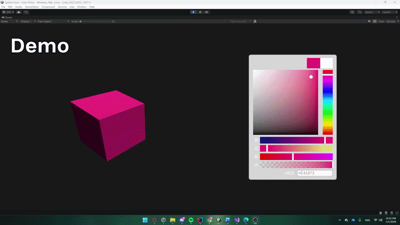
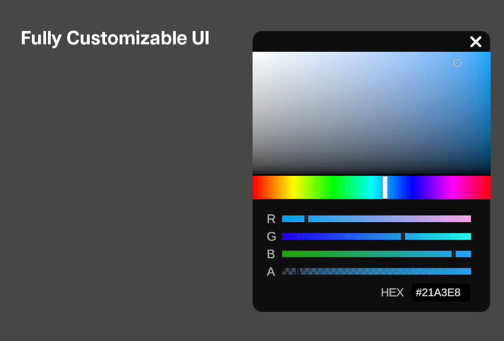

# Modular Unity Color Picker

A modular, performance-optimized color picker for Unity with full RGBA, HSV, and Hex support.

---

## 🎥 Demo

<!-- Add a GIF or short video here -->
<!-- Example:  -->


---

## Features

* Supports **RGBA, HSV, and Hex** input
* Modular prefab — easily reusable across projects
* Performance optimized for smooth interaction
* Fully customizable UI (remove or modify elements safely)
* Displays previous color
* Built-in performance settings

---

## Installation

### Option 1 — Unity Package (Recommended)

1. Download `Color_Picker.unitypackage`
2. Import it into your Unity project

### Option 2 — Manual

1. Copy the `Color Picker/` folder into your project
2. Drag the prefab into your Canvas
3. Assign:

   * Canvas
   * Graphic Raycaster

---

## Usage

### Access current color

```csharp
Color current = colorPicker.CurrentColor;
```

### Set color

```csharp
colorPicker.SetColor(Color.red);
```

### Set using HSV

```csharp
colorPicker.SetColorHSV(h, s, v);
```

### Set using Hex

```csharp
colorPicker.SetColorHex("#FF0000");
```

### Listen to color changes

```csharp
colorPicker.OnColorChanged += (color) =>
{
    Debug.Log(color);
};
```

---

## Design & Architecture

* Built as a single script + prefab system for simplicity
* Uses a **modular structure** so components can be removed safely
* Designed for plug-and-play integration

---

## Performance Notes

Early versions generated textures dynamically for UI elements, which caused major slowdowns (~20 FPS when interacting).

Optimizations include:

* Pre-generating static textures at startup
* Reusing textures instead of recalculating them
* Using Unity’s UI system for dynamic color updates

Result: smooth, responsive interaction

---

## Challenges

* Handling Canvas Scaler*issues for accurate drag behavior
* Implementing Hex and Color conversion
* Balancing visual accuracy vs performance

---

## Future Additions

* Radial Hue Sliders

---

## Customizable UI Example



---

## Structure

```
Assets/
└── ColorPicker/
    ├── Scripts/
    ├── Prefabs/
    ├── Graphics/
    └── Demo/
```

---

## License

This project is licensed under the MIT License.
